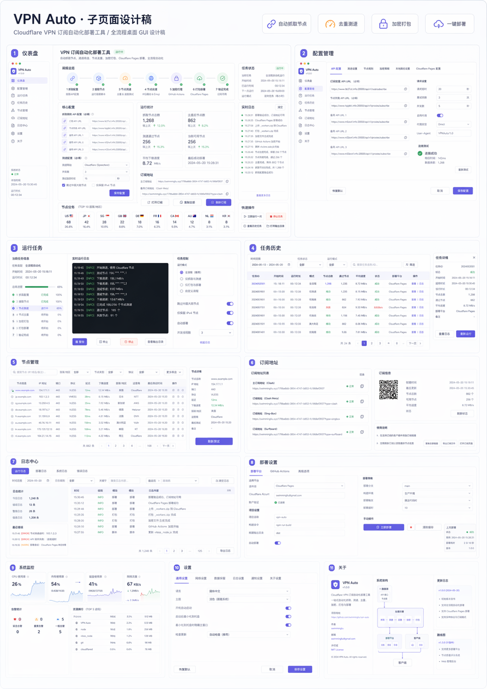

# AutoVPN

[](https://github.com/SwimmingLiu/vpn-subscription-automation/releases)
[](https://github.com/SwimmingLiu/vpn-subscription-automation/releases)
[]()
[](https://github.com/SwimmingLiu/vpn-subscription-automation/actions)



AutoVPN is a local-first Electron desktop app for collecting VPN nodes, testing connectivity and regional availability, generating subscription worker assets, and deploying the final subscription endpoint to Cloudflare Pages.

## 🚀 Features

- **Six-page desktop workspace**: Chinese-only dashboard for overview, run control, results, subscription links, logs, and settings.
- **Automated node pipeline**: Extracts multiple sources, deduplicates vmess links, runs Mihomo connectivity checks, averages speedtest results, and filters by Gemini / ChatGPT / Claude availability.
- **Cloudflare Pages deployment**: Renders `vmess_node.js`, transforms and obfuscates the worker, packages sidecar modules, deploys to the `sub-nodes` Pages project, and verifies the final subscription URL.
- **Runtime recovery**: Stores checkpoints in SQLite `run.db`, resumes unfinished runs, and exposes script-based monitoring for long backend jobs.
- **Configurable worker build**: Uses `state/profile.toml` as the canonical runtime profile, including `[worker_build]` options for entry filenames, module output, identifier randomization, and keyword fragmentation.
- **Packaged macOS app**: Builds a DMG with a project-derived transparent icon from `electron/renderer/assets/vpn-auto-logo-v2-minimal.svg`.

## ✨ Tech Stack

| Layer | Technology |
|-------|------------|
| Desktop shell | Electron 37 |
| Renderer | Native HTML / CSS / ES modules |
| Backend | Python 3.12 package under `src/vpn_automation` |
| Runtime config | TOML profile + SQLite checkpoints |
| Automation | Mihomo, Playwright, Cloudflare Wrangler |
| Packaging | electron-builder DMG |
| Tests | pytest, node:test, Playwright-powered Electron tests |
| CI release | GitHub Actions on `release.published` |

## 📦 Installation

### macOS Release Build

Download the latest `AutoVPN-<version>-<arch>.dmg` from [Releases](https://github.com/SwimmingLiu/vpn-subscription-automation/releases), open it, and drag `AutoVPN.app` into `Applications`.

Current release builds target macOS. The packaging script uses macOS icon tools (`qlmanage`, `sips`, and `iconutil`) and emits a DMG through electron-builder.

The current DMG packages the Electron desktop shell and project runtime seed files. Pipeline execution still shells out to a host Python (`python3.12` or `python3`) with this project's Python dependencies installed, and it also expects external runtime tools such as `mihomo` and Cloudflare Wrangler/npm tooling to be available.

### Local Development Install

```bash
cd /Users/swimmingliu/data/VPN/vpn-subscription-automation
python3 -m venv .venv
source .venv/bin/activate
pip install -e .[dev]
npm install
npx playwright install chromium
brew install mihomo
```

Create `/Users/swimmingliu/data/VPN/vpn-subscription-automation/.env` with the Cloudflare token used by deploy stages:

```env
CLOUDFLARE_API_TOKEN=...
```

## 📁 Project Structure

```text
vpn-subscription-automation/
├── electron/                    # Electron main, preload, renderer, packaging runtime
│   ├── build/package.mjs         # Packaging pipeline and icon generation
│   ├── renderer/                 # Desktop UI source
│   └── runtime/                  # Packaged seed profile and staged runtime dependencies
├── src/vpn_automation/           # Python backend and pipeline modules
├── templates/                    # Worker templates
├── tests/                        # Python unit, integration, and e2e tests
├── electron/tests/               # Electron, renderer, and packaging tests
├── scripts/                      # Manual run, resume, and monitor helpers
├── docs/                         # Deployment notes and implementation plans
├── assets/                       # README screenshots
├── state/                        # Local runtime profile, ignored by git
├── artifacts/                    # Pipeline outputs, ignored by git
└── dist-electron/                # Electron build outputs, ignored by git
```

## 🔧 Development

Run the desktop app:

```bash
cd /Users/swimmingliu/data/VPN/vpn-subscription-automation
npm run electron:dev
```

Run the backend pipeline without Electron:

```bash
cd /Users/swimmingliu/data/VPN/vpn-subscription-automation
./scripts/run_backend_pipeline.sh
```

Run the headless CLI after `pip install -e .[dev]`:

```bash
autovpn profile show --project-root /opt/autovpn/vpn-subscription-automation
autovpn profile summary --project-root /opt/autovpn/vpn-subscription-automation --json
autovpn doctor --project-root /opt/autovpn/vpn-subscription-automation --output human
autovpn run --project-root /opt/autovpn/vpn-subscription-automation --skip-deploy --skip-verify --output jsonl
autovpn artifacts latest --project-root /opt/autovpn/vpn-subscription-automation
```

The `autovpn` command is the terminal and Agent-facing interface. It reuses the same Python backend as Electron and supports profile, run, artifact, retry, and resume operations without opening the desktop client.

For long terminal or Agent runs, start a detached job and reconnect later:

```bash
autovpn run --project-root /opt/autovpn/vpn-subscription-automation --skip-deploy --skip-verify --detach --json
autovpn status --project-root /opt/autovpn/vpn-subscription-automation --json
autovpn logs --project-root /opt/autovpn/vpn-subscription-automation --tail 200
autovpn stop --project-root /opt/autovpn/vpn-subscription-automation
```

Detached job state is stored under `state/jobs/` with `job.json`, `events.jsonl`, `human.log`, `stdout.log`, and `stderr.log`.

For Linux/headless deployment checks, run:

```bash
autovpn doctor --project-root /opt/autovpn/vpn-subscription-automation --output json
autovpn doctor --project-root /opt/autovpn/vpn-subscription-automation --deploy --strict --output human
```

`doctor` reports `pass`, `warn`, and `fail` checks for Python, profile paths, source configuration, Mihomo, Node/npm/npx, Playwright, and Cloudflare readiness. It does not run the full pipeline or perform a real deploy.

For a complete terminal-only install path, dependency matrix, troubleshooting, and redaction rules, see [`docs/headless-agent/linux-headless-guide.md`](docs/headless-agent/linux-headless-guide.md).

Agents should use the project-local AutoVPN skill at [`.codex/skills/autovpn-agent/SKILL.md`](.codex/skills/autovpn-agent/SKILL.md), which defines the safe CLI operating flow and redaction rules.

Preview the backend plan without starting network work:

```bash
cd /Users/swimmingliu/data/VPN/vpn-subscription-automation
./scripts/run_backend_pipeline.sh --dry-run
```

Deploy and verify the subscription worker:

```bash
cd /Users/swimmingliu/data/VPN/vpn-subscription-automation
./scripts/run_backend_pipeline.sh --with-deploy --with-verify
```

Monitor the latest run:

```bash
cd /Users/swimmingliu/data/VPN/vpn-subscription-automation
./scripts/monitor_run.sh --once
```

Run tests:

```bash
cd /Users/swimmingliu/data/VPN/vpn-subscription-automation
./scripts/run_pytest.sh tests -v
npm run test:electron
npm run test:all
```

Package the macOS desktop app:

```bash
cd /Users/swimmingliu/data/VPN/vpn-subscription-automation
npm run package:electron
```

Default local output:

- `dist-electron/mac-arm64/AutoVPN.app`
- `dist-electron/AutoVPN-1.0.0-arm64.dmg`

## ⚙️ Runtime Configuration

AutoVPN uses one canonical runtime profile:

- `/Users/swimmingliu/data/VPN/vpn-subscription-automation/state/profile.toml`

The file is local runtime state and is ignored by git. Electron and the Python backend both read and write this TOML profile. When running from `.worktrees/`, profile resolution still anchors to the main repository `state/profile.toml`.

The packaged seed profile is generated during packaging:

- `electron/runtime/default-profile.toml` is the tracked fallback seed.
- `electron/runtime/bundled-profile.toml` is generated by `electron/build/package.mjs`.
- If `state/profile.toml` exists, it is copied into `bundled-profile.toml`; otherwise the default seed is used.

Do not edit `electron/runtime/bundled-profile.toml` by hand.

## ☁️ Cloudflare Pages Model

The production deploy target is `sub-nodes`. The deploy flow is:

1. Render `artifacts/<run>/vmess_node.js`.
2. Transform it into `artifacts/<run>/worker_transformed.js`.
3. Obfuscate it into `artifacts/<run>/_worker.js`.
4. Package `artifacts/<run>/pages_bundle/_worker.js`, `modules/*.js`, and `manifest.json`.
5. Deploy with `npx wrangler pages deploy <pages_bundle> --project-name <project_name> --branch main`.

The explicit `--branch main` is required because `https://sub-nodes.pages.dev` follows the Production deployment, not preview branches.

## 🚢 Release Packaging

`.github/workflows/release-electron.yml` runs after a GitHub Release is published. It checks out the release tag, installs Node.js 24 and Python 3.12, runs the full test suite, builds the Electron DMG, verifies the packaged app icon, and uploads `dist-electron` assets back to the release.

The CI packaging path intentionally uses the same command as local builds:

```bash
npm run package:electron
```

The build must not report `default Electron icon is used`. The icon source is `electron/renderer/assets/vpn-auto-logo-v2-minimal.svg`, and generated icon resources must preserve the transparent background.

## 😇 Trust & Security

- **Local-first runtime**: The desktop app runs the pipeline locally and stores runtime config in `state/profile.toml`.
- **Explicit deploy credentials**: Cloudflare deployment requires `CLOUDFLARE_API_TOKEN`; without it, deploy stages are blocked.
- **Auditable release builds**: Release packaging runs in GitHub Actions and uploads the generated DMG to the matching release.
- **Project-derived branding**: The packaged app icon is generated from an in-repo SVG, never from the default Electron placeholder.

## 📜 License

No license file is currently checked into this repository. Add one before distributing AutoVPN outside private/internal use.
