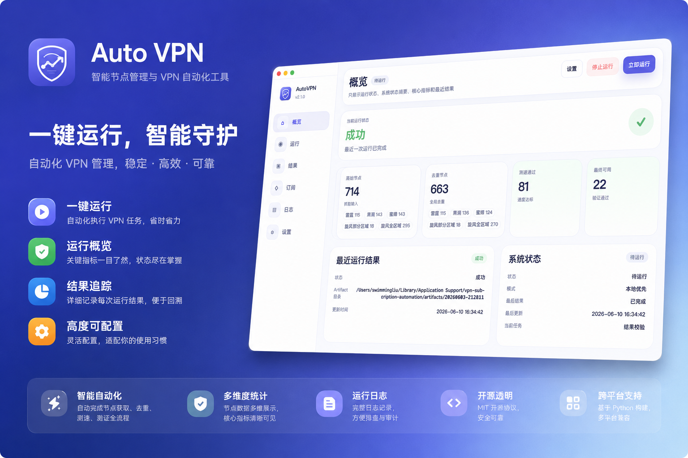

# AutoVPN

[](https://github.com/SwimmingLiu/auto-vpn/releases)
[](https://github.com/SwimmingLiu/auto-vpn/releases)
[]()
[](https://github.com/SwimmingLiu/auto-vpn/actions)



AutoVPN is a desktop control center for turning raw VPN node sources into tested subscription endpoints. It keeps the pipeline local, verifies node quality and service availability, then publishes the final Cloudflare Pages worker when deployment credentials are available.

## Features

- Six focused workspace pages for overview, runs, results, subscriptions, logs, and settings.
- Automated node extraction, deduplication, Mihomo connectivity checks, speed tests, and availability filters.
- Cloudflare Pages deployment with worker rendering, transformation, obfuscation, packaging, and verification.
- Recoverable runs backed by SQLite checkpoints and `~/.auto-vpn/profile.toml`.
- Multi-platform Electron packaging with project-owned transparent icon assets.

## Tech Stack

| Layer | Stack |
| --- | --- |
| Desktop | Electron 37, native HTML/CSS/ES modules |
| Backend | Python 3.12 under `src/vpn_automation` |
| Runtime state | TOML profile, SQLite checkpoints |
| Automation | Mihomo, Playwright, Cloudflare Wrangler |
| Packaging | electron-builder for DMG, DEB, RPM, NSIS, portable EXE |
| Tests | pytest, node:test, Playwright-backed renderer checks |

## Installation

Download the latest installer from [GitHub Releases](https://github.com/SwimmingLiu/auto-vpn/releases).

| Platform | Assets |
| --- | --- |
| macOS | `AutoVPN-<version>-arm64.dmg`, `AutoVPN-<version>-x64.dmg` |
| Linux | `AutoVPN-<version>-amd64.deb`, `AutoVPN-<version>-x86_64.rpm`, `AutoVPN-<version>-arm64.deb`, `AutoVPN-<version>-aarch64.rpm` |
| Windows | `AutoVPN-<version>-x64-setup.exe`, `AutoVPN-<version>-x64-portable.exe`, `AutoVPN-<version>-arm64-setup.exe`, `AutoVPN-<version>-arm64-portable.exe` |
| CLI | `vpn_subscription_automation-<version>-py3-none-any.whl`, `vpn_subscription_automation-<version>.tar.gz`, `swimmingliu-autovpn-<version>.tgz` |

The desktop installers bundle the Electron shell, runtime seed files, Python dependencies, browser probe runtime, and worker template. They do not install the terminal `autovpn` command. For terminal use on Linux servers, headless hosts, CI, or Agents, install the CLI separately.

## CLI Quickstart

The CLI entrypoint is `autovpn`. It uses the same automation backend as the desktop app and stores runtime data under `~/.auto-vpn/` by default:

- profile: `~/.auto-vpn/profile.toml`
- run artifacts: `~/.auto-vpn/artifacts/`
- detached job state and logs: `~/.auto-vpn/jobs/`

Set `VPN_AUTOMATION_RUNTIME_ROOT` to move those files together.

Install the npm wrapper when a Node.js-native install flow is easier. It requires Node.js `>=22.5.0`:

```bash
npx -y https://github.com/SwimmingLiu/auto-vpn/releases/download/v<version>/swimmingliu-autovpn-<version>.tgz --version
npm install -g https://github.com/SwimmingLiu/auto-vpn/releases/download/v<version>/swimmingliu-autovpn-<version>.tgz
autovpn --version
```

The npm wrapper exposes the same `autovpn` command. For commands that still need Python, it resolves the backend from `AUTOVPN_PYTHON_CLI`, a compatible PATH `autovpn`, or a wrapper-managed Python virtual environment. Set `AUTOVPN_NO_INSTALL=1` in locked-down CI if automatic backend installation should be disabled.

Install the Python CLI from a release wheel when you want a pure Python installation:

```bash
python3.12 -m pip install --user pipx
python3.12 -m pipx ensurepath
pipx install https://github.com/SwimmingLiu/auto-vpn/releases/download/v<version>/vpn_subscription_automation-<version>-py3-none-any.whl
autovpn --version
```

Alternatively, install into a project virtual environment:

```bash
cd /opt/autovpn/vpn-subscription-automation
python -m venv .venv
source .venv/bin/activate
python -m pip install https://github.com/SwimmingLiu/auto-vpn/releases/download/v<version>/vpn_subscription_automation-<version>-py3-none-any.whl
autovpn --help
```

Common CLI checks and local dry runs:

```bash
autovpn doctor --project-root /opt/autovpn/vpn-subscription-automation --output human
autovpn profile summary --project-root /opt/autovpn/vpn-subscription-automation --json
autovpn run --project-root /opt/autovpn/vpn-subscription-automation --skip-deploy --skip-verify --output jsonl
autovpn artifacts latest --project-root /opt/autovpn/vpn-subscription-automation
```

The npm CLI defaults high-risk `run` execution to the Python backend for production compatibility. For v3 Node-backend validation, run the experimental Node orchestrator as a foreground pipeline. Use the full form to exercise deploy/verify, or add `--skip-deploy --skip-verify` for an offline pipeline check:

```bash
AUTOVPN_BACKEND=node autovpn run --project-root /opt/autovpn/vpn-subscription-automation --output jsonl
```

This mode writes normal artifacts and JSONL events, loads project `.env` before resolving profile and artifact paths, and uses the Node deploy/verify stages for plain Cloudflare Pages flows, including primary blocked-project fallback, share-project subscription sync, custom-domain binding, and custom-domain DNS upsert. Detached jobs, `retry-stage`, `resume`, and `--resume-latest` still use the Python backend.

For long terminal or Agent runs, start a detached job and reconnect later:

```bash
autovpn run --project-root /opt/autovpn/vpn-subscription-automation --skip-deploy --skip-verify --detach --json
autovpn status --project-root /opt/autovpn/vpn-subscription-automation --json
autovpn logs --project-root /opt/autovpn/vpn-subscription-automation --tail 200
autovpn stop --project-root /opt/autovpn/vpn-subscription-automation
```

Pipeline stages that call external tools still require those tools locally, including `mihomo` and Cloudflare Wrangler/npm tooling. For a complete terminal-only install path, dependency matrix, troubleshooting, and redaction rules, see [`docs/headless-agent/linux-headless-guide.md`](docs/headless-agent/linux-headless-guide.md).

## Project Structure

```text
vpn-subscription-automation/
├── electron/          # Electron main, preload, renderer, runtime, packaging
├── src/               # Python automation backend
├── templates/         # Worker templates
├── tests/             # Python tests
├── electron/tests/    # Electron and renderer tests
├── scripts/           # Run, resume, monitor, and release helpers
├── docs/              # Notes and implementation plans
├── assets/            # README media
├── state/             # Optional build-time seed profile, ignored by git
├── artifacts/         # Legacy local outputs, ignored by git
└── dist-electron/     # Packaged app outputs, ignored by git
```

## Development

Install local dependencies:

```bash
cd ~/data/VPN/vpn-subscription-automation
python3.12 -m venv .venv
source .venv/bin/activate
pip install -e .[dev]
npm install
npx playwright install chromium
brew install mihomo
```

Run the desktop app:

```bash
npm run electron:dev
```

Run the backend pipeline:

```bash
./scripts/run_backend_pipeline.sh --dry-run
./scripts/run_backend_pipeline.sh --with-deploy --with-verify
./scripts/monitor_run.sh --once
```

Run the headless CLI after `pip install -e .[dev]`:

```bash
autovpn profile show --project-root /opt/autovpn/vpn-subscription-automation
autovpn profile summary --project-root /opt/autovpn/vpn-subscription-automation --json
autovpn doctor --project-root /opt/autovpn/vpn-subscription-automation --output human
autovpn run --project-root /opt/autovpn/vpn-subscription-automation --skip-deploy --skip-verify --output jsonl
autovpn artifacts latest --project-root /opt/autovpn/vpn-subscription-automation
```

The `autovpn` command is the terminal and Agent-facing interface. It defaults to the same Python backend as Electron for production runs and now also includes an opt-in Node backend for v2/v3 pipeline migration validation.

Run the npm wrapper from source during development:

```bash
npm ci --prefix npm/autovpn-cli
npm test --prefix npm/autovpn-cli
(cd npm/autovpn-cli && npm pack --pack-destination .)
AUTOVPN_PYTHON_CLI="$(command -v autovpn)" AUTOVPN_NO_INSTALL=1 npx -y ./npm/autovpn-cli/*.tgz --version
AUTOVPN_PYTHON_CLI="$(command -v autovpn)" AUTOVPN_NO_INSTALL=1 npx -y ./npm/autovpn-cli/*.tgz doctor --project-root "$PWD" --output json
AUTOVPN_BACKEND=node npx -y ./npm/autovpn-cli/*.tgz run --project-root "$PWD" --output jsonl
```

Deploy under `AUTOVPN_BACKEND=node` is still experimental. Plain Wrangler Pages deploys, primary blocked-project fallback creation, share-project `SUB` sync, share-project fallback, custom-domain binding, custom-domain DNS upsert, fallback config cloning, and verify run in Node. Set `AUTOVPN_STAGE_BACKEND_DEPLOY=python` or `AUTOVPN_STAGE_BACKEND_VERIFY=python` only when you need to roll a stage back to the Python adapter.

For long terminal or Agent runs, start a detached job and reconnect later:

```bash
autovpn run --project-root /opt/autovpn/vpn-subscription-automation --skip-deploy --skip-verify --detach --json
autovpn status --project-root /opt/autovpn/vpn-subscription-automation --json
autovpn logs --project-root /opt/autovpn/vpn-subscription-automation --tail 200
autovpn stop --project-root /opt/autovpn/vpn-subscription-automation
```

Detached job state is stored under `~/.auto-vpn/jobs/` with `job.json`, `events.jsonl`, `human.log`, `stdout.log`, and `stderr.log`.

For Linux/headless deployment checks, run:

```bash
autovpn doctor --project-root /opt/autovpn/vpn-subscription-automation --output json
autovpn doctor --project-root /opt/autovpn/vpn-subscription-automation --deploy --strict --output human
```

`doctor` reports `pass`, `warn`, and `fail` checks for Python, profile paths, source configuration, Mihomo, Node/npm/npx, Playwright, and Cloudflare readiness. It does not run the full pipeline or perform a real deploy.

For a complete terminal-only install path, dependency matrix, troubleshooting, and redaction rules, see [`docs/headless-agent/linux-headless-guide.md`](docs/headless-agent/linux-headless-guide.md).

Agents should use the project-local AutoVPN skill at [`.codex/skills/autovpn-agent/SKILL.md`](.codex/skills/autovpn-agent/SKILL.md), which defines the safe CLI operating flow and redaction rules.

Run tests:

```bash
./scripts/run_pytest.sh tests -v
npm run test:electron
npm run test:all
```

Build local packages:

```bash
npm run package:electron
AUTOVPN_PACKAGE_PLATFORM=linux AUTOVPN_PACKAGE_ARCH=x64 npm run package:electron
AUTOVPN_PACKAGE_PLATFORM=win AUTOVPN_PACKAGE_ARCH=arm64 npm run package:electron
```

## Runtime Configuration

AutoVPN reads and writes one local runtime profile:

- `~/.auto-vpn/profile.toml`

Runtime artifacts and job logs are stored under `~/.auto-vpn/artifacts/` and `~/.auto-vpn/jobs/`. Set `VPN_AUTOMATION_RUNTIME_ROOT` to move all runtime files together.

Packaged builds seed the runtime profile from `electron/runtime/default-profile.toml` or a generated `electron/runtime/bundled-profile.toml`. The generated bundled profile is build output; do not edit it by hand.

## Release Packaging

`.github/workflows/release-electron.yml` packages AutoVPN when a GitHub Release is published, a matching version tag is pushed, or a release rebuild is manually dispatched. The workflow validates the tag against `package.json`, runs the shared test gate, builds native macOS/Linux/Windows installers, uploads release assets, and rewrites the release notes.

The local and CI packaging entrypoint is the same:

```bash
npm run package:electron
```

The build must not report `default Electron icon is used`. The icon source is `electron/renderer/assets/vpn-auto-logo-v2-minimal.svg`, and generated icon resources must preserve transparency.

## Trust & Security

- Local-first execution keeps runtime config and pipeline state on the host.
- Cloudflare deployment requires an explicit `CLOUDFLARE_API_TOKEN`.
- Release artifacts are built by GitHub Actions from the matching tag.
- App branding comes from checked-in project assets, not Electron placeholders.

## License

No license file is currently checked into this repository. Add one before distributing AutoVPN outside private/internal use.
